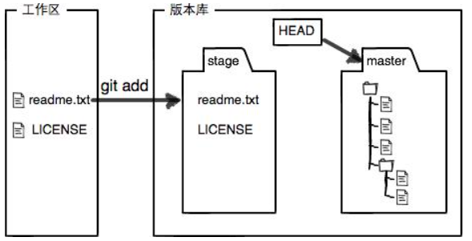
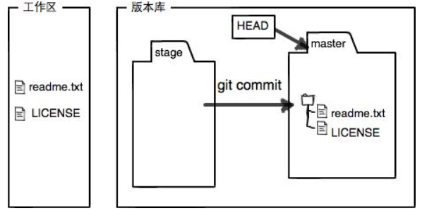
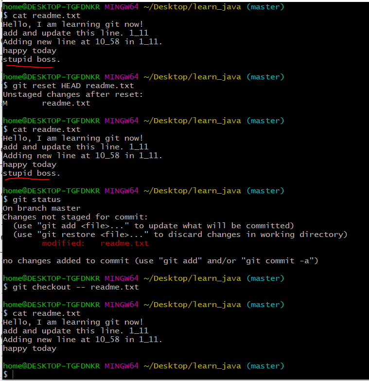

# [基础语法和时光穿梭机](./basic_grammer.md)
1. [版本回滚（回退）](#1)
2. [工作区和暂存区](#2)
3. [两种撤销](#3)
4. [删除文件](#4)  

## 基础命令
```git
git init                      //初始化Git仓库
git add <file>                //添加文件
git commit -m <message>       //提交文件
git status                    //了解工作区的状态
git diff                      //查看修改内容（有什么不同）
git log --pretty=oneline      //使log的用一行显示
git log                       //可以查看提交历史，以便确定要回退到哪个版本
git reflog                    //记录我的每一次命令（查看版本号）
git reset --hard HEAD^        //回滚到上一个版本
git reset --hard commit_id    //回滚到指定版本，commit_id是可以通过git log查看（没必要写全）
git checkout -- <file>        //把<文件>在工作区的修改全部撤销(2)恢复一个手动删除但已添加到版本库的文件
git reset HEAD <file>         //将暂存区的修改撤销掉（unstage）,重新放回工作区
```
## 1 
_版本回滚（回退）_  
**reflog**用来记录你的每一次命令,图一执行命令```git commit readme.txt -m "10_58_in_1_11"```提交一次新文件后变化如下。可以看到**最近提交的数字是最小的，为0**。  
替换前  
  
替换后  
  
```cpp
```  
## 2
_工作区和暂存区_，**add与commit的区别**  
add**就是把新修改的文件添加到暂存区stage**  
  
commit**就是把暂存区的所有内容提交到当前分支**  
  
```cpp
```  
## 3
_两种撤销_  
- 未add，使用```git checkout -- <file>```  
  - 修改了未add存缓存(stage)
  - 已存缓存(stage)再次修改但未add
- 已add，使用```git reset HEAD <file> ```。使用该命令会只会撤销存缓存的修改，这时候还需要撤销add的操作。  

```cpp
```  
## 4  
_删除文件_  
- 手动删除是```rm <file>```
  - 如果是不小心用```git checkout -- <file>```**恢复**。
  - 如果确实想删除，就```git rm <file>```再commit。**所以想删除直接git rm好了**就不用rm再git rm了。
- git删除是```git rm <file>```，这样删除的文件是不可能通过checkout恢复的，**想要恢复只能回滚**。
```cpp
```  
