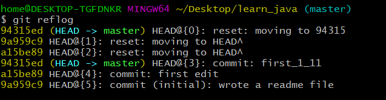
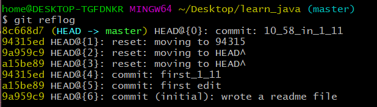

# [基础语法和时光穿梭机](./basic_grammer.md)
1. [reflog](#1)
2. [](#2)
3. [](#3)
4. [](#4)  

## 基础命令
```git
git init                      //初始化Git仓库
git add <file>                //添加文件
git commit -m <message>       //提交文件
git status                    //了解工作区的状态
git diff                      //查看修改内容（有什么不同）
git log --pretty=oneline      //使log的用一行显示
git log                       //可以查看提交历史，以便确定要回退到哪个版本
git reflog                    //记录我的每一次命令（查看版本号）
git reset --hard HEAD^        //回滚到上一个版本
git reset --hard commit_id    //回滚到指定版本，commit_id是可以通过git log查看（没必要写全）
```
## 1 
_版本回滚__  
**reflog**用来记录你的每一次命令,图一执行命令```git commit readme.txt -m "10_58_in_1_11"```提交一次新文件后变化如下。可以看到**最近提交的数字是最小的，为0**。  
替换前  
  
替换后  
  
```cpp
```  
## 2
```cpp
```  
## 3
```cpp
```  
## 4
```cpp
```  
