# [分支管理](./branch_manage.md)
1. [基础分支操作](#1)
2. [不同的分支合并图](#2)
3. [案例：如何先处理Bug再回到开发分支](#3)
4. [案例：和小伙伴一起弄项目](#4)  _github为例_

# 本节命令

```
git branch											//查看分支
git branch <name>									//创建分支
git checkout <name>									//(方1)切换分支
git checkout -b <name>								//(方1)创建+切换分支
git switch <name>									//(方2)切换分支
git switch -c <name>								//(方1)创建+切换分支
git merge <name>									//合并某分支到当前分支
git merge --no-ff -m "----" <name>					//用普通模式合并，使历史有分支，能看出曾做过合并
git branch -d <name>								//删除分支
git branch -D <name>								//强行删除分支
git log --graph										//----写信息，查看分支合并图
git log --graph --pretty=oneline --abbrev-commit	//查看分支合并图(一行显示)
git status											//把当前工作现场“储藏”起来，等以后恢复现场后继续工作
git stash list										//查看保存的工作现场
git stash apply										//恢复工作现场(现只有一个工作现场情况，多个需指定)
git stash drop										//删除工作现场(现只有一个工作现场情况，多个需指定)
git stash pop										//恢复工作现场同时将stash内容删除
git stash apply stash@{0}							//恢复指定工作现场
git cherry-pick <commit>							//把在一分支bug提交的修改“复制”到当前分支，避免重复劳动
```


## 1

### 创建与合并分支

- ```git checkout -b dev```相当于执行了```git branch dev```和```git checkout dev```,如果查看分支的话，会发现当前正在使用的分支会有一个```*```。
- **合并**```merge```要留意是什么分支合并什么。因为一般是```dev```分支跑```master```前面，所以在合并时，是**切换回**```master```**分支进行**```merge```命令。
- 总结：稳定分支在后，开发在前，合并时要回到稳定分支使稳定与开发同步。而**不是用**_```dev```去```merge``` ```master```_。

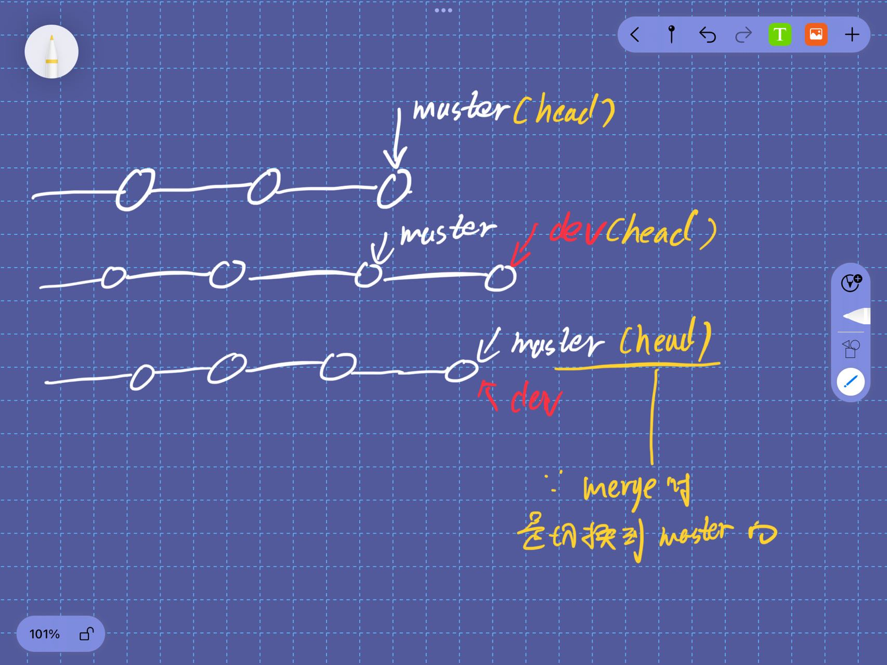

- ```git checkout <branch>```与前面提到的撤销修改```git checkout -- <file>```是同一命令，可使用```git switch```代替。

### 解决冲突

解决冲突的方式就是手动解决。

### 强行删除分支

有时候新开发一个分支老板说这个分支不喜欢不要了，那么此分支当然不可能会合并必须删除。但```git branch -d <name>```是无法删除的，这时候用```git branch -D <name>```即可，**这是强行删除**。

```
```
## 2

_不同的分支合并图_

### 2.1 正常合并

合并分支时，如果可能Git会使用```Fast forward```模式，简单理解就是默认方式。使用这种模式合并会丢掉分支信息。上图是默认合并前的分支图。下图中在```dev```分支中执行力``` git commit -m "23:39" ```后的分支图。

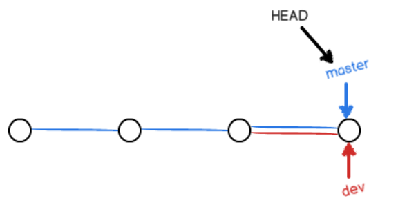

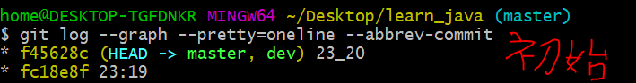

**默认合并好像就是正常的提交**，合并图并不会显示有合并过的迹象。

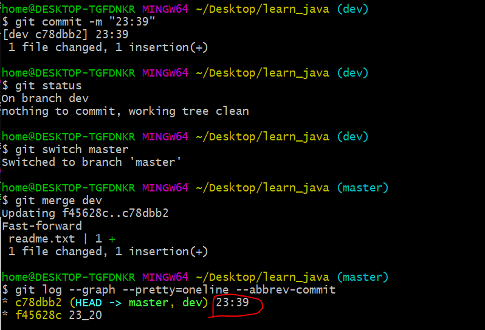

### 2.2 有冲突的合并

冲突原因是：先在```dev```修改```add```并提交```commit```后在```master```修改并提交，这时候在```master```分支上合并```dev```。合并图与廖老师的为什么不同呢？因为刚刚我的```dev```分支是提交过的，而廖老师的分支是新建的，所以会混了普通模式合并的内容。

记住**有冲突的合并是在合并失败后，手动修改冲突文件再重新修改并提交**便可解决冲突。

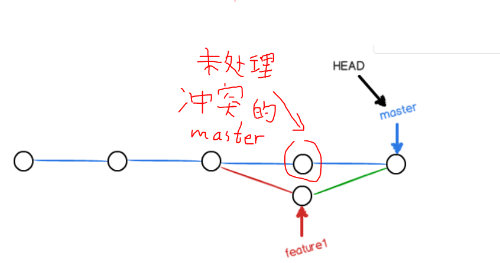

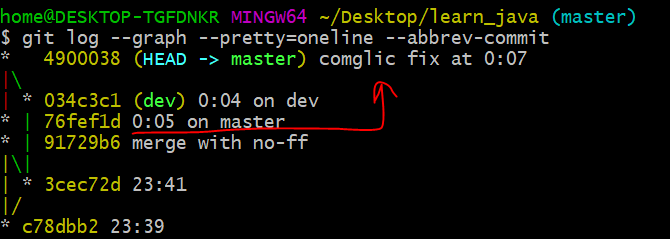

### 2.3 使用普通模式合并

**注意看红框**，合并信息一目了然，易看出分支是合并过的。

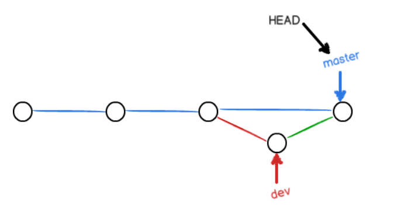

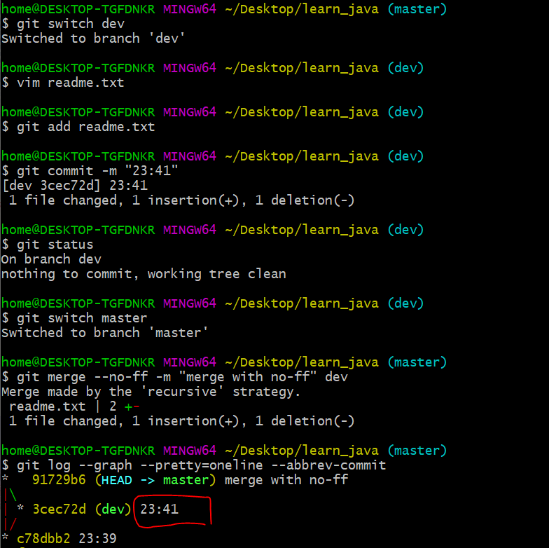

```
```
## 3

### 基本操作

- ```git stash```保存工作区
- ```git stash list```查看保存的工作区列表
- ```git stash apply```恢复工作区但不删除此**stash**
- ```git stash drop```删除工作区
- ```git stash pop```恢复并删除此工作区
- 想要指定工作区只需(以apply为例)```git stash apply stash@{0}```
- ```git cherry-pick <版本号>```复制一个特定的提交到当前分支，**一定要先执行此命令再恢复工作区**

### 案例：如何先处理Bug再回到开发分支

(1) 在开发过程中，有时候会碰到Bug在```master```上需处理但此时在```dev```开发得正嗨不能```add```和```commit```的情况(因为最好不要提交没有开发完成的版本)。有什么办法可以保存现在进度状态呢？

(2) 这时候就可以用```stash```把当前工作区储藏起来回到```master```分支修bug。**不过注意这时候是回到```master```分支上改Bug**，而不是在```dev```上修改。

(3) 因为```dev```比```master```要前，并且是没有发布到用户上的，难不成在```dev```上修复Bug再合并到```master```吗。所以就需要在```master```上创建一个新的分支来改Bug。最后在把修改的代码“同步”到```dev```上。

(4) 那么，怎么同步呢，又让这个```新分支```去和```dev```合并吗？显然不同，用```git cherry-pick```就可以把修改的代码“同步”到```dev```了。

(5) 总结上面说的，弄完Bug后，这个```新分支```与```master```合并后就可以删除了，这时候回到```dev```分支，**先用```git cherry-pick```把修Bug“同步”到```dev```再恢复工作区**。先恢复工作区再```git cherry-pick```会提示先“同步”再恢复。

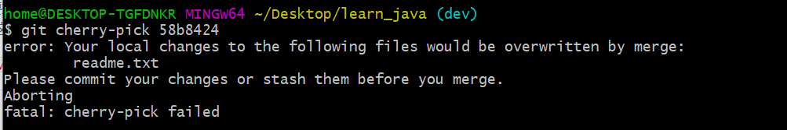

```
```
## 4

### 自己有多个SSH情况 

一开始以为要和小伙伴一起，*我的猜测是因为本地公钥会一一对应，*

### 案例：和小伙伴一起弄项目

(1) 首先在网上发现了一个很不错的开源项目，图中有两个需要注意的地方(图中两个框框)，在第二步会说明。现在想为此项目出一份力，那么就点击页面的```Fork```按钮，稍等片刻后会发现页面有所不同。

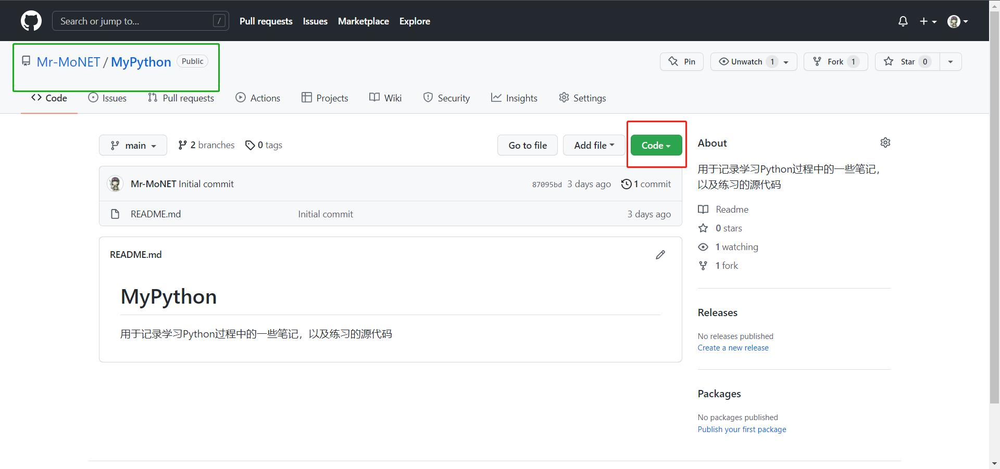

(2) 可以看到```Fork```后，左上角的框信息发生变化，说明了这个仓库是我```Fork```他人的。这时候再点击```Code```时也会发现SSH的地址有所不同了(箭头指向)，复制该地址用于克隆此远仓。

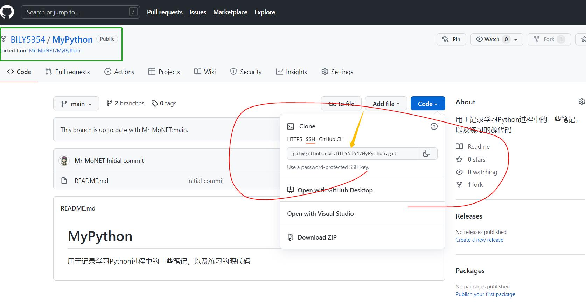

(3) 克隆远仓操作和之前一样，做些修改并提交再```Push```上去，这时可以发现，在我```Fork```页面是有相关修改信息的，但是此仓库所有人却没有。此时就是申请一个```Pull Request```。


(4) 仓库所有人看到后，觉得我的代码很不错，决定使用。我们还进行了友好的交流。


(5) 最后合并成功，感觉不错，又为开源做出贡献，今天也是美好的一天。

```
```
