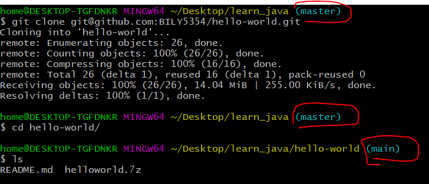
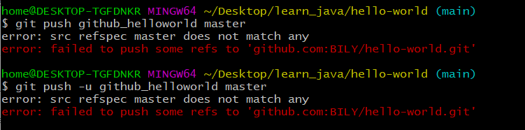
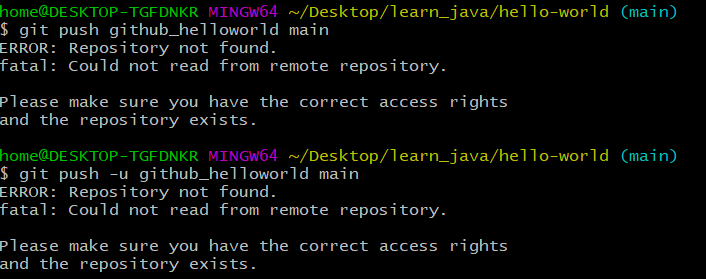
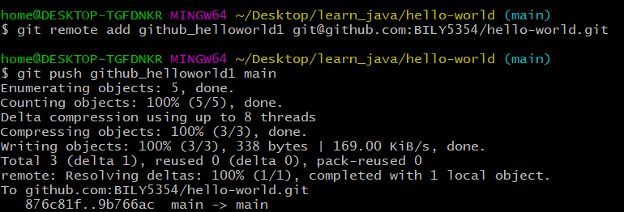

# [远程仓库](./remote_repository.md)
1. [远仓基本设置](#1)
2. [添加远程仓库](#2)
3. [从远程仓库克隆](#3)
4. [](#4)  
```
# 本节命令
git remote add origin git@server-name:path/repo-name.git              # 关联一个远程库,origin是默认习惯命名
git push -u origin master                                             # 第一次推送master分支的所有内容
git push origin master                                                # 第一次提交后，就可以使用本命令推送最新修改
git clone git@github.com:BILY5354/hello-world.git                     # 远程库已经准备好后克隆一个本地库
git remote rm <name>                                                  # 解除了本地和远程的绑定关系，并不是物理上删除了远程库
git remote -v                                                         # 查看远程仓库的数量（简单信息）
git remote show origin                                                # 查看某个远程仓库的具体信息，以origin为例：
git branch                                                            # 查看分支信息
```
## 1
_远仓基本设置_
[直接回看教程](https://www.liaoxuefeng.com/wiki/896043488029600/896954117292416#0)
```cpp
```  
## 2
_添加远程仓库_  
- 首先在github(gitee也行)上创建一个仓库，注意**这个仓库一定是空的，不要初始化**，也就是readme这些都是没有的。再本地用```git remote add origin git@server-name:path/repo-name.git```创建关联，再用```git push -u origin master```第一次推送**orgin是刚刚创建的关联master是远仓的分支名字**，以后再次推送就用```git push origin master```即可。
- 如果想既推github和gitee就需要设置多个关联了。
```cpp
```
### push解释
> Form github:
> Use git push to push commits made on your local branch to a remote repository.
> The git push command takes two arguments:
> - A remote name, for example, origin
> - A branch name, for example, master
> For example:  
``` git push <REMOTENAME> <BRANCHNAME> ```也就是git push **本地仓库** **远程分支名字**   
> As an example, you usually run $ git push origin master to push your local changes to your online repository.  
  
## 3
_从远程仓库克隆_  
- 克隆远仓(注意branch的变化)  
  
当然也可以使用```git branch```查看。
- 远仓的**branch**别写错了，我现在的远仓**branch**是```main```但我写了```master```。
 
- 远仓克隆下来想要推送**同样也需要创建关联**，否则错误提示：
 
- 最终顺顺利利。  
 
```cpp
```  
## 4
__
```cpp
```  
